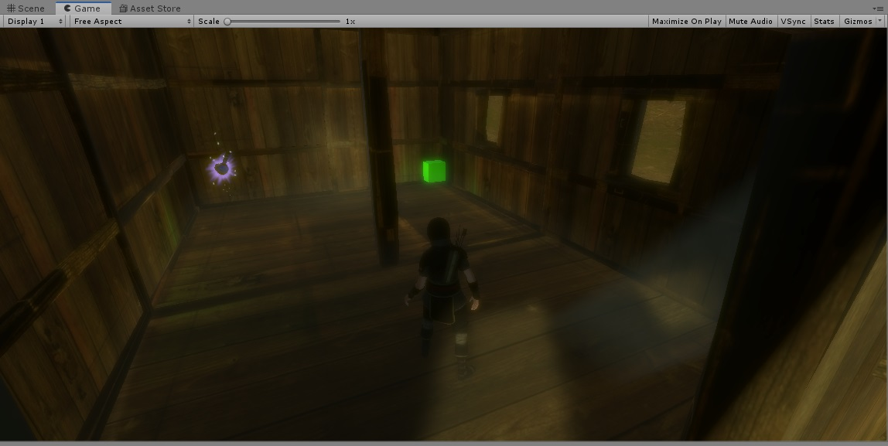
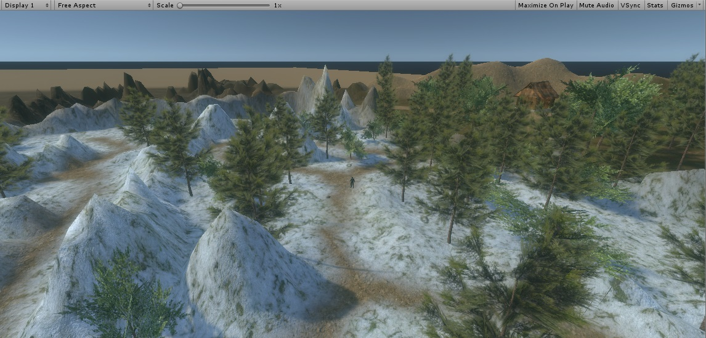
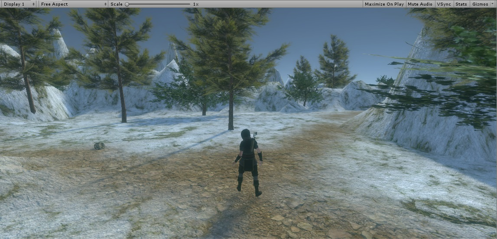
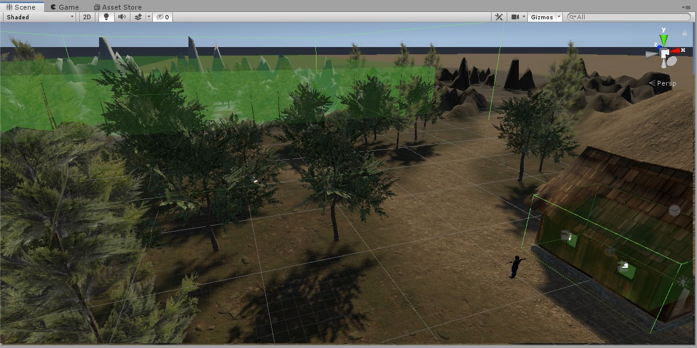

# Prototipo Landscape 3D usando Unity (2019.2.12f1) y HDRP.

**Nota: Unity ofrece el package "High Definition Render Pipeline" de forma gratuita, pero hay que tener en cuenta que es experimental.**

## Capturas

## Demo ejecución

### Notas:
El HDRP tiene sus ventajas y limitaciones.
 Te permite acceder a un amplio abanico de efectos (luces volumétricas, nieblas, bloom, etc.), pero algunas herramientas de Unity como la creación de árboles dejan de funcionar correctamente. Por eso es conveniente, de momento, utilizar assets de árboles ya generados.
